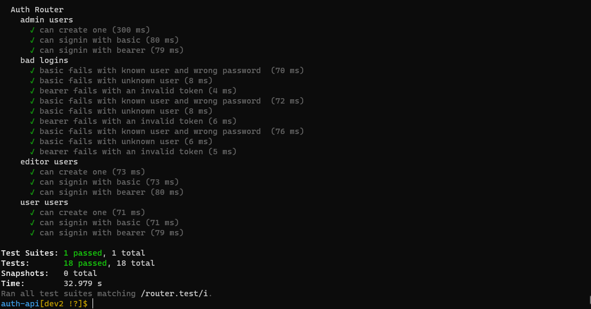

# auth-api

## LAB - 08
## **Deployment Test**
## **Author: Tasnim Wheebi**
[PR LINK](https://github.com/Tasnimwheebi/auth-api/pull/2 (Links to an external site.) )

[Heroku APP](https://tasnim-auth-api.herokuapp.com/)

[Report Test](https://github.com/Tasnimwheebi/auth-api/actions)

## **Setup**
* .env requirements
  * PORT - 3000
  * MONGOOSE_URI=mongodb://tasnimwheebi:***************
  * SECRET=*********

## **Running the app**

###   Dependencies: 
    {
    "@code-fellows/supergoose": "^1.1.0",
    "base-64": "^1.0.0",
    "bcrypt": "^5.0.1",
    "cors": "^2.8.5",
    "dotenv": "^10.0.0",
    "express": "^4.17.1",
    "fs": "0.0.1-security",
    "jest": "^27.0.1",
    "jsonwebtoken": "^8.5.1",
    "mongoose": "^5.12.11",
    "morgan": "^1.10.0"
  }
  

* Endpoint: 

**npm start**

**nodemon**

 * `/signup` : json object
   

          [
        "user"
          {
              "_id":""
            "username": "tasnim",
            "password": ""
            }

           ]

* `/signup`  : json object 

            [

                {
                 "_id": "60ad2acdba47913ff41982fc",
                  "username": "tasnim",
                  "password": "$2b$10$5Mb7oWIMGYUMTVuQSqtCl.TtQJX04uUyUe2OTWBXj/mKw73nHBjfW",
                  "__v": 0
                }

           ]  

 * `/users` 

        [
            "tasnim",
            "tasnim1",
            "tasnim2",
            "tasnim3"
        ] 

* `/secret`

            'Welcome to the secret area' 

* `api/v1/clothes`
 
    By specifiying the role you can :
    * create a new clothes object.
    * update by id.
    * delete by id.

            {
                "name":"T-shirt",
                "size":"large",
                "color":"green"
             }

* `api/v2/food`

By specifiying the role you can :

  * create a new food object.
 * update by id.
 * delete by id.

            {
                "name":"starawberry",
                "type":"FRUIT",
                "calories":12
             }

  * `/`
            
        Return Welcome to my web App

  * `/bad` 

          Something went wrong

  * `*`

        Page not found 404

## **Tests**

npm test

* Test 1

* Test 2

* 404 on a bad route
* 404 on a bad method
* The correct status codes and returned data for each REST route
  * Test the creation of new user using POST .
  * Test the signup route to login as a user.
  * Test the record user . 
  * Test the role of user what the permission is : read , create , update and delete .

## **UML Diagram**

